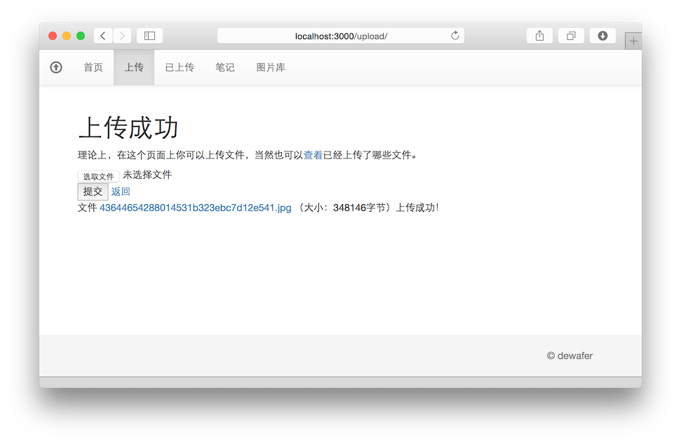
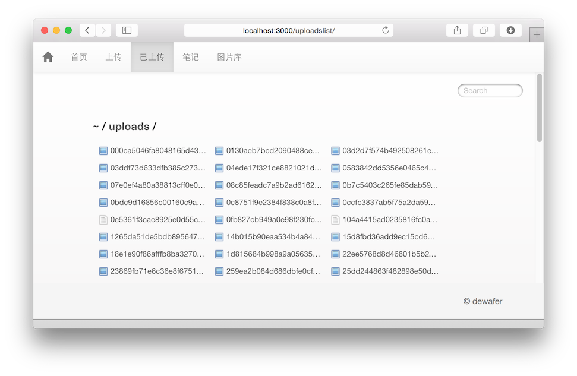
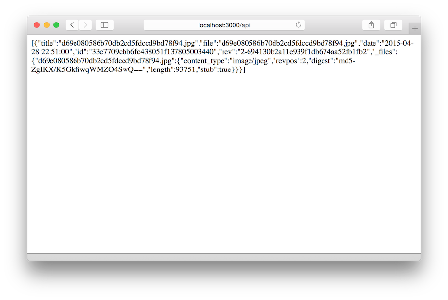

# APP的功能简介卷轴

2015年5月8日更新

* 使用bootstrap美化前端
* 发布至bluemix云上，现在可以通过[appnext.mybluemix.net](http://appnext.mybluemix.net)实时访问本app的server端啦！


2015年4月28日更新

本APP开发到现在，大致能跑的功能如下：


## 服务器端
服务器端能用的功能如下图所示（首页图片）:


各功能的说明：

### 1.上传
通过上传页面能够将文件上传至服务器端uploads目录下。


### 2.已上传文件列表
这个页面上列出了服务器端uploads目录下的所有文件。（使用了[serve-index](https://www.npmjs.com/package/serve-index)。）



### 3.笔记
一个简单的TODO列表，可以通过笔记页面增加或删除一个项目。


数据保存在CouchDB中。APP会自动在CouchDB中创建一个名叫memo的Database，按一个笔记项目一个文档的形式保存在memo中。


### 4.图片库
一个简单的在线图片库，可以通过图片库页面增加或删除一张图片


上传的图片将首先保存在uploads中，然后再保存到CouchDB中。APP会自动在CouchDB中创建一个名叫images的Database，按一张图片一个文档的形式保存在images中。


上传后的图片可以通过下面这个API取得，服务器将以图片的形式返回数据库中的数据（Content-Type: image/jpeg，同数据库中的值相同）。移动端使用此此API获取图片。

	http://localhost:3000/api/[document-id]/[attachment-name]


### 5.API
服务器端还提供了一个返回JSON对象的RESTful的API接口来供客户端使用。

发送GET请求到下面这个地址将返回一个JSON数组包含图片库中所有项目的详细内容。

```
	http://localhost:3000/api/
	

```


获取图片的API接口请参照4.图片库中的说明。

本API还预留了其他几个接口，但因为还未使用到所以暂不在此列出，请参阅代码。


## Android客户端
Android客户端暂时仅实现了从服务器端拉去图片列表并显示在一个GridView中，并且点击图片可以查看大图的功能。

* 当App启动时，将自动从服务器端的API接口处拉去最新的图片列表。
* 拉取的图片列表保存在内存中，然后开始根据取到的结果加载GridView。
* 当每一个GridView中的子View加载时，首先会往这个子View中放入一个转动的ProgressBar并启用一个AsyncTask去服务器的图片获取API（服务器端得4.图片库中说明的API内容）下载图片并放入缓存中。
* 当图片下载完成后，GridView中的子View中的ProgressBar将被删除并替换成图片的ImageView来显示。
* 如果这张图片已经下载到缓存中，以后再次加载时就从缓存中取得图片而不是重新下载。
* 在ActionBar上增加了一个刷新按钮，点击后会清除缓存并从新去服务器端拉去图片列表和图片。
* 点击GridView中的图片后，会开启一个新的Activity并将用户点击的图片的大图（无缩放）显示在这个Activity中。


